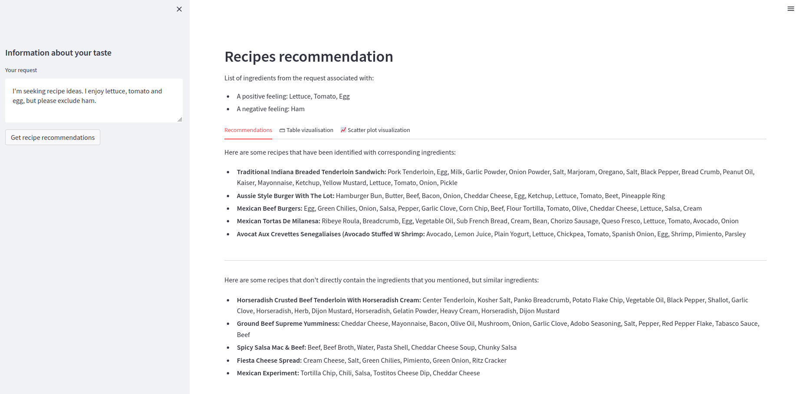
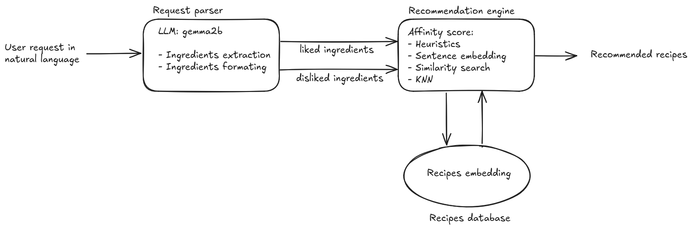

  

# Recipe recommender system

- [Recipe recommender system](#recipe-recommender-system)
- [1. 💬 Project description](#1--project-description)
- [2. 📟 Prerequisites](#2--prerequisites)
- [3. 🔌 Quickstart](#3--quickstart)
  - [3.1 ⚙️ Set up](#31-️-set-up)
  - [3.2 🚀 Run](#32--run)
- [4. 🔗 System architecture](#4--system-architecture)
- [5. 📁 Dataset](#5--dataset)
- [6. 👁️ Exploratory data analysis](#6-️-exploratory-data-analysis)
- [7 🏆 Code Quality and Formatting](#7--code-quality-and-formatting)
- [8. 📚 Complementary documentation](#8--complementary-documentation)


# 1. 💬 Project description

The following repo implements a content based recipe recommendation system. The system leverages a LLM to handle the 
user request, and a mix of heuristics, sentence embedding and similarity search to suggest recipes based on a user's 
request in natural language. It is implemented using Streamlit, faiss, and ollama.

For a more detailed explanation, please refer to the analysis step available: [here](https://pdgarden.github.io/recipe-recommender-system/).


# 2. 📟 Prerequisites

The project uses:
- uv (`v0.5.10`) to handle python version and dependencies.
- ollama (`v0.5.5`) to interact with the LLM for ingredients extraction.
- quarto to (`v1.4.554`) to generate the EDA report.


# 3. 🔌 Quickstart


## 3.1 ⚙️ Set up

1. Install ollama (v0.5.5): See instructions [here](https://github.com/ollama/ollama)
2. Install the model [gemma2:2b](https://ollama.com/library/gemma2:2b): `ollama run gemma2:2b`
3. Install uv (v0.5.10):
   1. For macOS / Linux `curl -LsSf https://astral.sh/uv/0.5.10/install.sh | sh`
   2. For windows: `powershell -ExecutionPolicy ByPass -c "irm https://astral.sh/uv/0.5.10/install.ps1 | iex"`
4. Create virtual environment: `uv sync --all-groups`
5. To develop (Optional):
   1. Setup pre-commit: `uv run pre-commit install -t commit-msg -t pre-commit`
   2. Install quarto (v1.4.554): See instructions [here](https://quarto.org/docs/get-started/)
   3. Display the EDA locally `uv run quarto preview --execute`


The lock file only contains dependencies necessary to run the Streamlit app.

## 3.2 🚀 Run

Once the set up is done, the app can be launched by executing the following command:

```sh
uv run streamlit run app/app.py
```

Here is what the app looks like:



# 4. 🔗 System architecture

The system is decoupled into different parts, allowing each part to be improved independently of the other parts.




# 5. 📁 Dataset

The recipe recommendation system suggests recipes based on an affinity score computed with every recipes of a dataset.

* The dataset used is a sample of +6000 recipes extracted from the [recipeDB](https://cosylab.iiitd.edu.in/recipedb/)
* For each recipe, the name, ingredients and origin is provided


# 6. 👁️ Exploratory data analysis

The EDA (Exploratory Data Analysis) steps are done trough the notebooks in the `eda` folder. The current notebook are:
- `eda_recipe_recommendations.ipynb`: explore the use of word embeddings and KNN algorithm to define an affinity score for the user.
- `eda_ingredients_extraction.ipynb`: explore the extraction of ingredients a user requests by using small LLMs.


The corresponding EDA are deployed online using Quarto and are accessible [here](https://pdgarden.github.io/recipe-recommender-system/).


# 7 🏆 Code Quality and Formatting

- The python files are linted and formatted using ruff, see configuration in `pyproject.toml`
- Pre-commit configuration is available to ensure trigger quality checks (e.g. linter)
- Commit messages follow the conventional commit convention
- A CI pipeline is implemented on github to lint code and redeploy docs


# 8. 📚 Complementary documentation

- [Ollama](https://ollama.com/): To interact with the LLM
- [HuggingFace's sentence transformers](https://huggingface.co/sentence-transformers): To generate embeddings
- [Faiss](https://faiss.ai/index.html): For efficient similarity search
